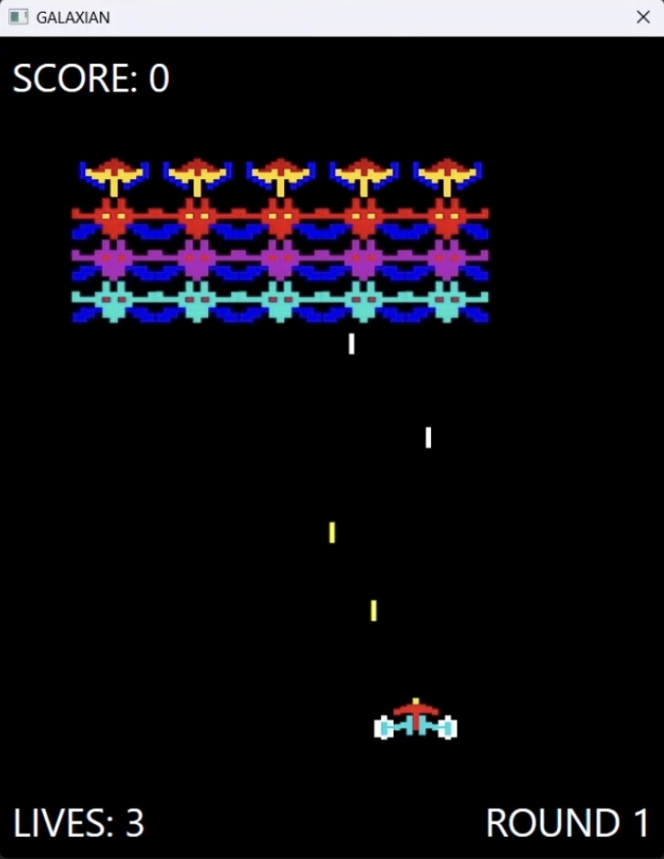

# ギャラクシアン C# WPF版
ナムコのシューティングゲーム「ギャラクシアン」をWPFを使用して再現してみました。

以前Javaでも同様のゲームを制作しましたので、操作方法やスコア表、主な内容については下記リンクをご参照ください ↓

https://github.com/motomasMINO/Galaxian-Java



## 概要
- プレイヤーは自機を操作して、上空から編隊組んで攻撃してくるエイリアンを撃墜します。
- サウンドやスプライト描画、当たり判定なども実装しています。
- 1UPシステム(ボーナススコアでライフが1追加)
- ゲームオーバー後にスペースキーを押すとリスタート

## 🛠️ 使用技術
- **フレームワーク :** .NET 9
- **GUI :** WPF
- **サウンドライブラリ :** [NAudio](https://github.com/naudio/NAudio)

## クラス構成 (抜粋)
- `MainWindow.xaml` : メインウィンドウ
- `MainWindow.xaml.cs` : ゲームロジック及びゲームループ管理
- `Player` : 自機の状態や移動、弾の制御
- `Enemy` : 各種敵キャラクターの挙動と描画
- `Bullet` : 弾の管理、移動、衝突判定
- `Sound` : NAudioを使用したサウンドの再生・ループ制御
- `LoopStream` : BGMループ処理用のカスタムクラス

## 🔊 サウンド再生について
NAudioを使用して、効果音やBGMを再生しています。　`Sound.cs`では、個別のサウンドファイルを以下のように扱います。

```csharp
Sound bgm = new Sound("bgm.wav");
bgm.Loop(); // ループ再生

Sound sfx = new Sound("explosion.wav");
sfcx.play(); // 一度だけ再生
```

## 💻 実行方法
1. **必要環境**
- Visual Studio 2022 以降
- .NET Framework または .NET 9

2. **リポジトリのクローン(ダウンロード)**
   
   ターミナルまたはコマンドプロンプトで以下を実行:
   ```bash
   git clone https://github.com/motomasMINO/Galaxian-WPF.git
   cd Galaxian-WPF
   ```

3. **アプリ起動**
　
   ```bash
   cd Galaxian
   dotnet run
   ```

## 📜 ライセンス
このプロジェクトはMIT Licenseのもとで公開されています。

## 📧 お問い合わせ
- Github: motomasMINO
- Email: yu120615@gmail.com

  バグ報告や改善点・機能追加の提案はPull RequestまたはIssueで受け付けています!